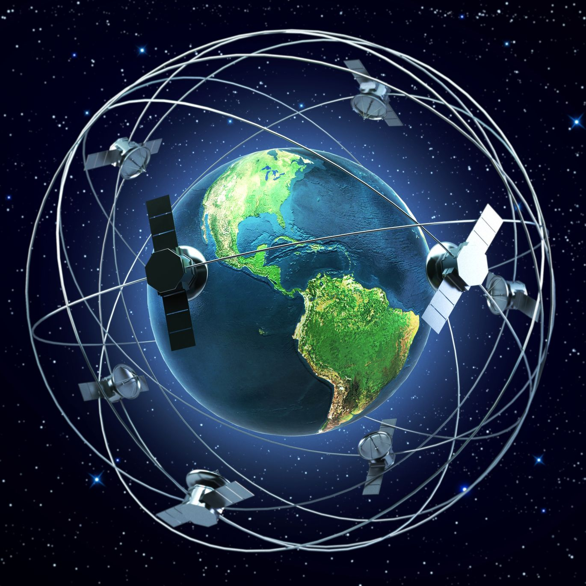

# Satellite Tracking App

Let's build a satellite tracking platform that provides users with the latest position updates for satellites orbiting the Earth. Built using cutting-edge technologies like React, Java, and PostgreSQL 🚀🛰️🪐.

  

This exercise involves building a Satellite Tracking App with frontend and backend components, allowing users to create, update, and delete satellites and view their positions on an earth map.
- The frontend should include a map, list, and search bar components, leveraging React-Redux or React Context API for data management.
- The backend requires implementing APIs, using a data store, Docker, Java, and necessary unit tests.
- The submitted assessment must have clear setup instructions, be free of console errors, and meet all specific requirements listed in the instructions below. 
- Bonus points are awarded for additional features such as theme support and using three.js.

---

# Business requirements - frontend

We're building a Satellite Tracking App where the user can create, update and delete the satellites and see their projected positions on an earth map.

- [ ] The user is able to see all available satellites in the sidebar list and on the map (A 2D earth map is fine).
- [ ] The satellites can be static or moving, whichever is easier for you.
  - [ ] use [react-map-gl] (https://visgl.github.io/react-map-gl/) for the map
- [ ] When the user clicks on the add satellite button
  - [ ] a popup with the form appears
  - [ ] user must enter the satellite `name`, `owner`, `longitude` and `latitude` in order to save the form
- [ ] When the user clicks on the edit satellite button, follow the same requirements as for the add satellite button
- [ ] When the user clicks on the delete the satellite button
  - [ ] the popup with the warning message `Are you sure you want to delete the satellite - {satellite.name}?` appears
  - [ ] user must approve or reject an action by click on the 'continue' or 'cancel' button
- [ ] When the user selects a satellite in the list:
  - [ ] the list item is highlighted
  - [ ] the map centers on the satellite location area
  - [ ] a popup with the satellite details is shown
- [ ] When the user clicks on a satellite on the map
  - [ ] the proper list item is highlighted
  - [ ] it shows a popup with the satellite details
- [ ] User is able to search the satellite by `id`, `name`, `owner`.
- [ ] When the user searches for satellites, the map and the list should display only the satellites which match the user query.
- [ ] [react-redux](https://react-redux.js.org/) or [react context api](https://react-redux.js.org/) is used for data managment
- [ ] At least one pertinent automated test has been written
- [ ] you need to create an application with at least 3 components:
    - a `<Map />` component to display the earth and the satellites positions
    - a `<List />` component to provide the list of satellites
    - and a `<SearchBar />` component to provide a search functionality related to this context

# Business requirements - backend
- [ ] implement the APIs as defined
- [ ] use a data store to save the needed info
- [ ] use Docker and provide a docker-compose file
- [ ] use Java
- [ ] implement the needed unit tests
- [ ] your code must compile

## APIs
- `GET /satellites`
  output: Satellite
- `PUT /satellites/<satellite-id>`
  input payload:
    name,
    latitude,
    longitude
- `POST /satellites`
  input payload:
    name,
    latitude,
    longitude,
    owner
  output: Satellite
- `DELETE /satellites/<satellite-id>`

## Data structures

### Satellite
	id: UUID | not null,
	name: String | not null,
	latitude: float | not null,
	longitude: float | not null,
	owner: string | nullable

# Bonus points

- [ ] The satelite list scrolls to the active item every time when it's updated
- [ ] [styled-components](https://styled-components.com/) is used for styling
- [ ] [theme](https://styled-components.com/docs/advanced#theming) is supported
- [ ] [threejs](https://threejs.org/) is used anywhere in the application
- [ ] during the update of a satellite the user can't update the satellites that are inside a predefined `Set<NotEditableZone>`
	- a NotEditableZone is a predefined object described by a single point (longitude, latitude) and a radius. All the Satellites inside that circle can't be edited

# What do we expect?

Please check all the following items for your assessment to meet our expectations:

- [ ] App is running with no console errors and warnings
- [ ] A README-candidate.md file describing project setup (commands to run, environment variables, etc.) and tradeoffs you have made
- [ ] the whole project must be runnable with the instructions you will provide, ideally we expect the backend to be runnable using one docker-compose command and the frontend to be runnable as is

# Authors
- Fatih Inanc: f.inanc@ai-build.com
- Maryan Shevchuk: m.shevchuk@ai-build.com
- Salvatore Coluccia: s.coluccia@ai-build.com
- Xavier Malina: x.malina@ai-build.com
